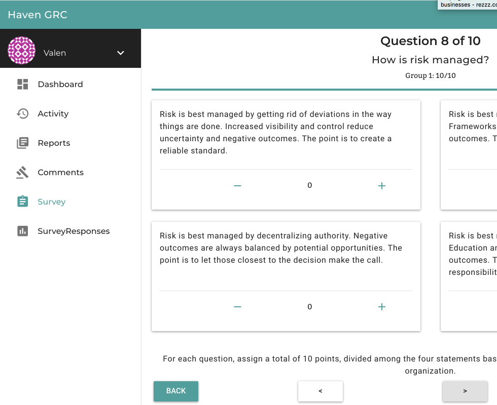

[](https://circleci.com/gh/kindlyops/mappamundi) [](http://github.com/badges/stability-badges) [](https://saythanks.io/to/statik) [](https://codeclimate.com/github/kindlyops/mappamundi/maintainability)

# Haven GRC is a modern risk & compliance dashboard

We help organizations avoid getting bogged down in rules that no longer make sense by integrating modern tools and practices without abandoning responsible oversight and administrative controls.

By prioritizing people and culture (beliefs and assumptions aka mental models) over prescriptive checklists, we build resilience and cut down on toil.

### But what does Haven GRC do?

-   Measures and reports on key security metrics. such as SCDS and FORCE.
-   Guided tool for performing scenario-based risk analysis as required by NIST CSF. Risk analysis modules is based on FAIR topology for quantitative risk estimation.
-   Calibration exercises for subject matter experts. Subject matter experts provide estimates based on their expert judgement, calibration training improves accuracy of estimates.
-   Tamper proof evidence store for compliance artifacts. Examples include risk acceptance documents, attestations that management oversight tasks have been completed, and third-party security assessment reports. Make your audits much easier!

### Future roadmap

-   Custom risk analysis models to support domains where subject matter experts have specific insights into the probability distribution of threats or losses
-   Guided tool for performing controls assessments
-   Features for Vendor Risk Management

### Complementary tools

Applications and frameworks that are complementary to Haven. We would prefer to integrate with rather than compete against these tools. They are great!

-   IT asset management with [SnipeIT](https://snipeitapp.com)
-   FISMA, NIST 800-53, NIST RMF, DFARS 800-171 documentation preparation for Authority To Operate [GovReady](https://govready.com)
-   SOC2 documentation and workflow assistance with [Comply](https://github.com/strongdm/comply)
-   Controls frameworks such as CIS Top 20 and NIST CSF

## 

## Table of Contents

<!--ts-->
- [Haven GRC is a modern risk & compliance dashboard](#haven-grc-is-a-modern-risk--compliance-dashboard)
        - [But what does Haven GRC do?](#but-what-does-haven-grc-do)
        - [Future roadmap](#future-roadmap)
        - [Complementary tools](#complementary-tools)
    - [!screenshot of app](#screenshot-of-app)
    - [Table of Contents](#table-of-contents)
    - [thank you to vendors that support the project](#thank-you-to-vendors-that-support-the-project)
    - [setting up the dev environment](#setting-up-the-dev-environment)
        - [Tmux](#tmux)
        - [Windows users](#windows-users)
    - [running the service](#running-the-service)
        - [to access the main webUI](#to-access-the-main-webui)
        - [to access the swagger-ui for the postgrest API](#to-access-the-swagger-ui-for-the-postgrest-api)
        - [to access keycloak](#to-access-keycloak)
        - [to access the GitBook documentation site](#to-access-the-gitbook-documentation-site)
        - [to see emails sent from Haven / keycloak](#to-see-emails-sent-from-haven--keycloak)
        - [Background jobs](#background-jobs)
        - [Monitoring activity with Grafana](#monitoring-activity-with-grafana)
        - [Security scanning with Zed Attack Proxy](#security-scanning-with-zed-attack-proxy)
        - [Bazel](#bazel)
    - [Developer tips](#developer-tips)
        - [look around inside the database](#look-around-inside-the-database)
        - [Run Go Buffalo tasks](#run-go-buffalo-tasks)
        - [to export keycloak realm data (to refresh the dev users)](#to-export-keycloak-realm-data-to-refresh-the-dev-users)
        - [To clear local storage in Chrome for your local site](#to-clear-local-storage-in-chrome-for-your-local-site)
        - [Testing on a real mobile device](#testing-on-a-real-mobile-device)
        - [add a database migration](#add-a-database-migration)
    - [Authentication with JWT and Keycloak](#authentication-with-jwt-and-keycloak)
        - [roles and permissions](#roles-and-permissions)
        - [multi-tenancy](#multi-tenancy)
        - [Low level JWT interactions](#low-level-jwt-interactions)
    - [Learning Elm](#learning-elm)
        - [Design framework and tooling](#design-framework-and-tooling)
    - [Working with RMarkdown templates](#working-with-rmarkdown-templates)
    - [Deploying with kubernetes / OpenShift](#deploying-with-kubernetes--openshift)
        - [Using OpenShift](#using-openshift)
        - [Database resource](#database-resource)
        - [TLS](#tls)

<!--te-->
## thank you to vendors that support the project

We use [BrowserStack](http://browserstack.com) to efficiently check cross-browser compatibility while building Haven. We are using snyk.io and codeclimate.com for static scanning. Thank you for providing free services to open source projects!

<!-- markdownlint-disable MD033 -->
[](http://browserstack.com/)

## setting up the dev environment

The db schema and migrations are managed using flyway. The PostgreSQL server, the PostgREST API server, and the flyway tool are all run from docker containers to reduce the need for local toolchain installation (java, haskell, postgresql)

To check and see if you have docker available and set up

    docker -v
    docker-compose -v
    docker info

If you don't have docker running, use [these instructions](https://docs.docker.com/docker-for-mac/). At the time of writing, this is working fine with docker 1.12.

### Tmux

We have a tmux session defined with https://github.com/tmux-python/tmuxp/ this may make it easier to monitor logs as you work. This is also handy if you want to do development on a remote VM.

    pip install --user tmuxp
    tmuxp load ~/go/src/github.com/kindlyops/mappamundi

### Windows users

Before you continue, you need to configure git to auto-correct line ending formats:

     git config --global core.autocrlf false

Docker versions prior to 18.0.9.0 have a bug on windows. To work around the bug
set this in your PowerShell before invoking docker

    $Env:COMPOSE_CONVERT_WINDOWS_PATHS=1

This workaround is described in the [GitHub issue](https://github.com/docker/for-win/issues/1829#issuecomment-376928286).

## running the service

You will normally run all the services using:

    docker-compose up
    docker-compose run flyway # applies database migrations

From this point on, you just just be able to use docker-compose up/down normally. Move on to access the main webUI in the next section.

### to access the main webUI

Open [dev.havengrc.com](http://dev.havengrc.com/), click the login button. You can login with user1\@havengrc.com/password or user2\@havengrc.com/password. User2 will prompt you to configure 2Factor authentication.

If you cannot connect to [dev.havengrc.com](http://dev.havengrc.com), try getting the docker machine ip using the command `docker-machine ip default` and use that instead.

### to access the swagger-ui for the postgrest API

Open [localhost:3002](http://localhost:3002/)

The swagger browser is loading the authenicated api by default. To view the public API, adjust the file being loaded to public.json.

To refresh the swagger documentation, such as after modifying postgres to expose additional APIs, use these commands

    curl http://localhost:2015/api/ > webui/public/swagger/public.json
    export TOKEN=`./get-token`
    curl -H "Authorization: Bearer $TOKEN" http://localhost:2015/api/ > webui/public/swagger/authenticated.json

### to access keycloak

Open [localhost:2015/auth/](http://localhost:2015/auth/), you can sign in with admin/admin

### to access the GitBook documentation site

Open [docs.dev.havengrc.com](http://docs.dev.havengrc.com/)

### to see emails sent from Haven / keycloak

Open [mailhog.dev.havengrc.com](http://mailhog.dev.havengrc.com), you can use mailhog to see messages stored in memory

### Background jobs

The background job worker system is Faktory. You can view the webui in development by opening http://localhost:7420

The credentials for the faktory webui in the dev environment are

    faktory / fassword

You can monitor jobs as they are submitted and run. The workers run in separate containers.

### Monitoring activity with Grafana

There is a grafana dashboard that you can view at [localhost:3500](http://localhost:3500/). The username is admin and the password is foobar.

### Security scanning with Zed Attack Proxy

You can run the ZAP baseline scan with

    docker-compose run zap

### Bazel

We are experimenting with the bazel build tool. Get it from https://bazel.build/

To build the keycloak service providers jar

    bazel build //keycloak-service-providers:spi_deploy.jar

## Developer tips

### look around inside the database

The psql client is installed in the flyway image, and can connect to the DB server running in the database container.

    docker-compose run --entrypoint="psql -h db -U postgres mappamundi_dev" flyway
    \l                          # list databases in this server
    \dn                         # show the schemas
    \dt mappa.*                 # show the tables in the mappa schema
    SET ROLE member;            # assume the member role
    SELECT * from foo LIMIT 1;  # run arbitrary queries
    \q                          # disconnect

We also have pgadmin4 running on http://localhost:8081. You can sign in using user1\@havengrc.com/password. Once inside pgadmin4, you will need to add a server, the server hostname is 'db' and the credentials are postgres/postgres.

### Run Go Buffalo tasks

To see the grift tasks defined in havenapi, run this buffalo command

    docker-compose run havenapi buffalo task list

### to export keycloak realm data (to refresh the dev users)

After keycloak is running and you have made any desired config changes:

    docker-compose exec keycloak /opt/jboss/keycloak/bin/standalone.sh \
      -Dkeycloak.migration.action=export \
      -Dkeycloak.migration.provider=singleFile \
      -Dkeycloak.migration.file=/keycloak/havendev-realm.json \
      -Djboss.http.port=8888 \
      -Djboss.https.port=9999 \
      -Djboss.management.http.port=7777

### To clear local storage in Chrome for your local site

Sometimes messing with logins and cookies you get stuff corrupted and need to invalidate a session/drop some cookies/tokens that were in localstorage. Visit chrome://settings/cookies\#cont and search for localhost.

### Testing on a real mobile device

It's often useful to test your dev code on a variety of real world phones and tablets so you can confirm UI behavior. The easiest way to do this is with a tool called [ngrok](https://ngrok.com). ngrok creates a public URL to a local webserver. If you use ngrok, it's worth signing up for the free plan at least. You will be able to inspect the traffic going over the tunnel, and use http auth credentials to protect access to your tunnel and those you share it with.

If you have a free ngrok plan, something like this should work

    ngrok http -auth "user:password" 2015

If you have a paid ngrok plan, something like this should work

    ngrok http -auth "user:password" -subdomain=$USER-haven 2015

### add a database migration

Add a new sql file in flyway/sql, following the naming convention for versions.

``` {.sql}
CREATE TABLE mappa.foo
(
  name text NOT NULL PRIMARY KEY
);
```

    docker-compose run flyway # applies migrations
    docker-compose run flyway # reverts last migration
    # repeat until satisfied
    git add .
    git commit -m "Adding foo table"

## Authentication with JWT and Keycloak

### roles and permissions

Keycloak has sophisticated support for realms, roles, client roles, and custom mappers. For now, we use a simple scheme of a custom user attribute called role. role must be set to "member" or "admin", and a custom mapper has been configured so that a role claim will be included in the JWT access token. PostgREST will check the role claim and switch to the member or admin role defined in PostgREST. Inside the database, fields can access other parts of the JWT to store user identity.

### multi-tenancy

Multi-tenancy is still a work in progress. Initially we will use a single Keycloak ream, and enhance the signup flow to create an organization-per-user. Initially there will be no real organization support, but we will record organization\_id along with user\_id for all data stored. Later we will add support for creating organizations/teams, and will allow users to be a member of multiple organizations. They will only be able to have a single organization active at a time in a login session, and so we'll need an additional page in the login flow to allow the user to select which organization they are activating (once authentication completes).

### Low level JWT interactions

In order to be able to get a token for a user, the user must have no pending actions in keycloak (like email verification or password change). To exchange a username and password for a Keycloak JWT token with curl:

    TOKEN=`curl -s --data \
    "grant_type=password&client_id=havendev&scope=openid&username=user1@havengrc.com&password=password"\
    http://localhost:2015/auth/realms/havendev/protocol/openid-connect/token \
    | jq -r '.access_token'`

We also have a shortcut helper script you can use

    export TOKEN=`./get-token`

Then you can use that token by passing it in an Authorization header:

    curl -v -H "Authorization: Bearer $TOKEN" http://localhost:3001/comment

To read a file from the database:

    curl -H "Authorization: Bearer $TOKEN" -H "Accept: application/octet-stream" \
     http://localhost:3001/file?select=file --output result.pdf

To upload a base64 encoded file to the database via postgrest:

    curl -X POST -H "Authorization: Bearer $TOKEN"\
     -H 'Content-Type: application/json' \
     http://localhost:3001/file \
     -d '{"file": "'"$(base64 apitest/features/minimal.pdf)"'"}'

We will need an upgraded version of postgrest with a fix for [this postgrest bug](https://github.com/begriffs/postgrest/issues/906). We also need to modify the user signup process to set up the roles correctly.

To upload a file to the database via havenapi:

    curl -X POST -H "Authorization: Bearer $TOKEN" -F "name=filename.pdf" \
      -F "file=@apitest/features/minimal.pdf" \
      http://localhost:3000/api/files

You can decode the token to inspect the contents at jwt.io. You will need to get the public cert from the Keycloak Admin interface: Havendev-\>Realm Settings-\>Keys-\>Public Key and enter it into the jwt.io page to decode the token.

## Learning Elm

16 minute video by Richard Feldman that explains the framework architecture choices that Elm makes compared to jQuery and Flux. [From jQuery to Flux to Elm](https://www.youtube.com/watch?v=NgwQHGqIMbw).

Elm is also a language that compiles to javascript. Here are some resources for learning Elm. In particular, the DailyDrip course is quite good, and provides several wonderful example applications that are MIT licensed and have been used to help bootstrap this application. You should subscribe to DailyDrip and support their work.

-   [Free elm course](http://courses.knowthen.com/p/elm-for-beginners)
-   Daily Drip has an [excellent elm course](https://www.dailydrip.com/topics/elm) that sends you a little bit of code each day to work on
-   [Pragmatic Programmers course](https://pragmaticstudio.com/elm)
-   [Frontend Masters elm workshop](https://frontendmasters.com/courses/intro-elm/)

### Design framework and tooling

We are making use of the [Material Design](https://material.io/guidelines/) system as a base for our design. We are also using the implementation at [Daemonite](http://daemonite.github.io/material/).

Within the app we are using [SASS](http://sass-lang.com/), and the guidance from [Inverted Triangle CSS](https://www.xfive.co/blog/itcss-scalable-maintainable-css-architecture/) and [Reasonable CSS](http://rscss.io/) to try and keep the CSS manageable.

## Working with RMarkdown templates

To test the Rmarkdown template, run

    docker-compose run worker /home/havenuser/compilereport

## Deploying with kubernetes / OpenShift

Branches merged to master will push new docker images to the OpenShift cluster.

### Using OpenShift

Talk to your administrator about getting an OpenShift account set up. Once you have access to Kubernetes / OpenShift, you can use the `oc` command to interact with the platform and update Haven GRC deployments.

To get useful information to get oriented and find out what is happening:

    oc whoami
    oc project
    oc status -v
    oc get events

Here is an example of running migrations in production with `oc` .

    oc project haven-production
    # check to see if the migration job is there.
    oc get jobs
    oc delete job flyway-migrate
    oc create -f k8s/flyway-migration-job.yaml
    # check the logs of the job to see if the migration ran ok

OpenShift CLI versions vary depending on where you installed from. Installing via homebrew `brew install openshift-cli` on macOS is fresher than installing from the link in OpenShift web console. (We ran into a difference in command flags needed with different versions of `oc`).

### Database resource

In your Kubernetes cluster there must be an ExternalName Service defined named `db`. If your administrator has already set this up, you can see the endpoint by running:

    oc get services

There must also be secrets set up with the DB credentials.

### TLS

You can provision certificates from Let's Encrypt in manual mode with certbot. The key material should be stored in a k8s secret which the havenweb pod loads as a volume so that Caddy can serve the certificate.

    certbot certonly --manual --preferred-challenge=dns

    # to verify if the dns challenge record has been published,
    dig -t txt _acme-challenge.staging.havengrc.com

Once you complete the challenge and get the key material, edit the secret.

    base64 -i /etc/letsencrypt/live/staging.havengrc.com/fullchain.pem | pbcopy
    oc edit secrets/secretname

Replace the values for fullkey.pem and privkey.pem with base64 encoded versions of the new certificates. Save and exit.
