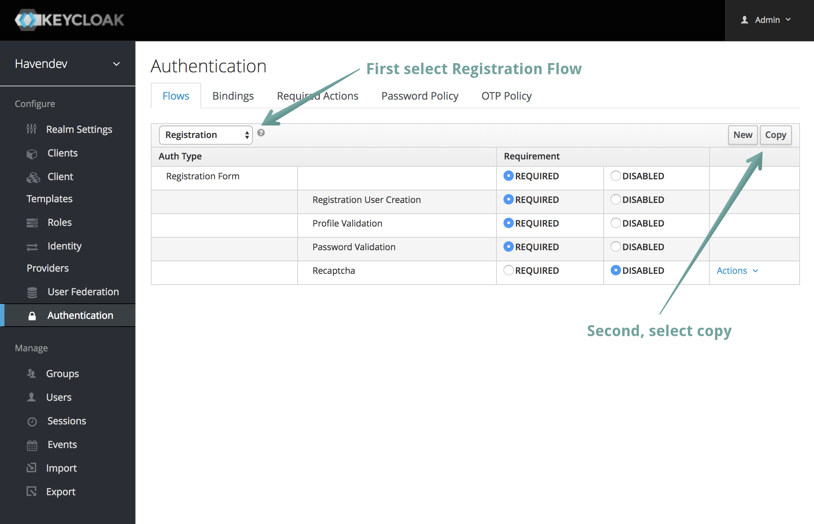
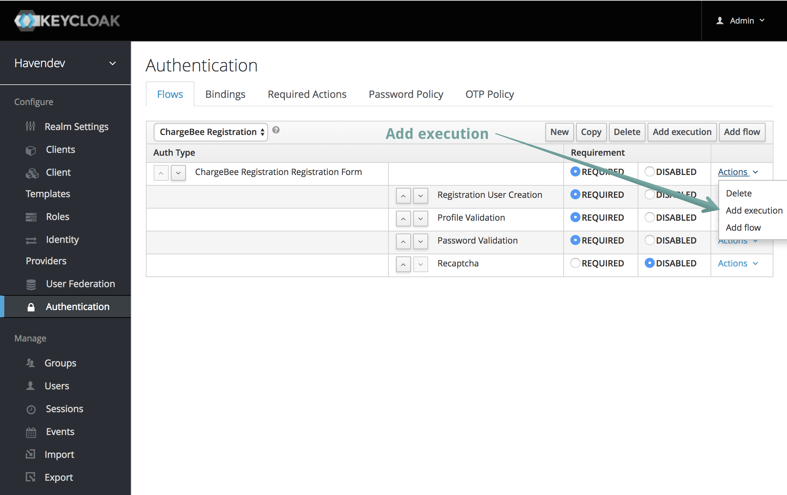
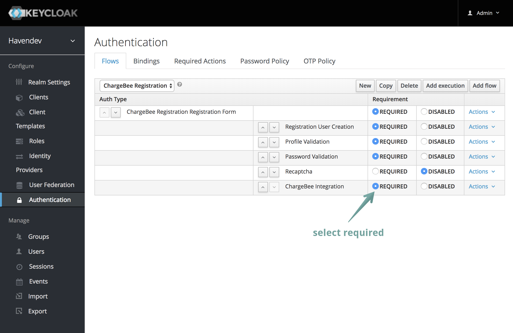
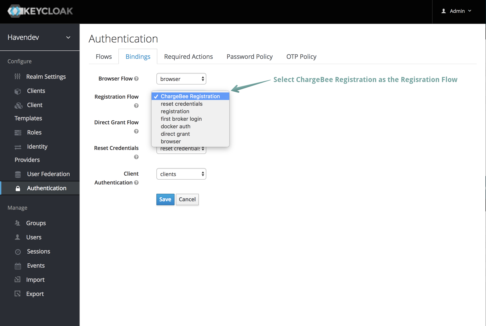

# ChargeBee SPI for Keycloak

This enables use of the ChargeBee API client library (Java flavor) for subscription billing & payments.

## Installing
Keycloak docs discuss two different ways to deploy SPIs not already included in Keycloak (http://www.keycloak.org/docs/latest/server_development/index.html#registering-provider-implementations)

Currently we use the Keycloak deployer and a few initial steps to assign the service provider (SPI) to a flow in keycloak. So this work is already done for you!

### Copy Registration Flow

In the Keycloak Admin Console there are some manual steps to complete.

Login to Keycloak Admin `localhost:8080`. On the far left menu go to Authentication section. Then under the Flows tab select Registration from the drop down menu. Then press the copy button on the far right. (See screenshot above)

Name the copy (i.e. ChargeBee Registration) and then add an execution to ChargeBee Registration Registration Form

Select ChargeBee Integration and toggle the radio button (if needed) for "Required"

Great now we need to bind this Flow so select the Bindindgs tab. Then under Regisration Flow select ChargeBee Integration and save.

## Development

For local development `docker-compose stop keycloak; docker-compose rm keycloak; docker-compose build keycloak; docker-compose up -d keycloak; docker-compose logs -f keycloak` is handy to deploy updated code for the SPI 
