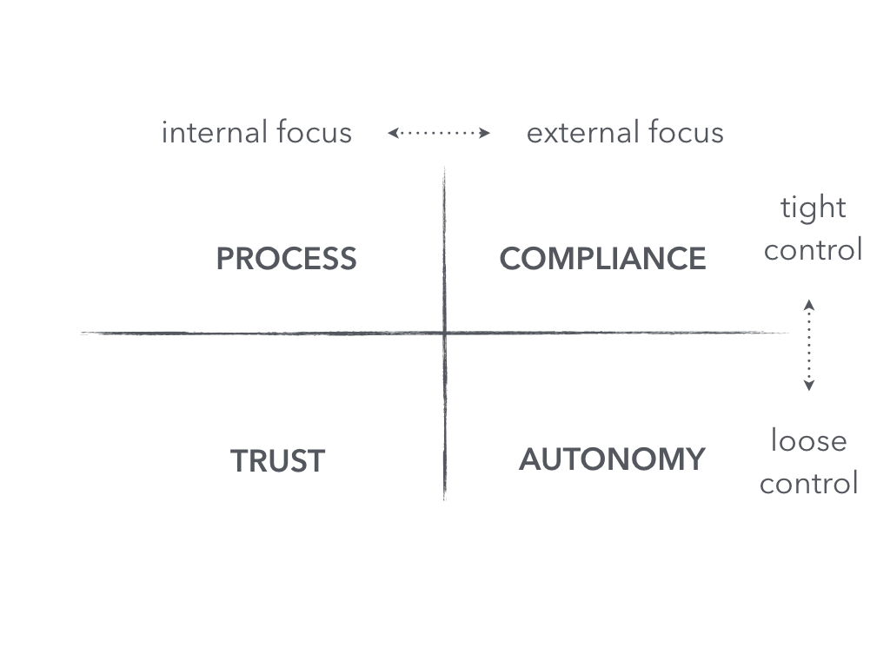

```{r setup, include=FALSE}
library(extrafont)
#extrafont::font_import(pattern = 'Roboto', prompt=FALSE)
extrafont::loadfonts(device="pdf")
extrafont::loadfonts(device="postscript")
library(gridExtra)
library(tufte)
library(ggradar)
library(ggplot2)
library(ggthemes)
library(reshape2)
library(plyr)
library(cowplot)
library(jsonlite)
suppressPackageStartupMessages(library(dplyr))
library(scales)
library(tibble)
library(stringr)
library(likert)
library(RColorBrewer)

knitr::opts_chunk$set(tidy = FALSE, cache.extra = packageVersion('tufte'))
```

### What is security culture?

The security culture diagnostic breaks down security culture into 4 mental
models.

Mental models are beliefs and assumptions that drive decisions and actions. You may
have a preferred or default mental model or way of looking at the world.

By learning the models you can be more deliberate
about which model you are choosing to use.

### notes
You can use these slides in your own company presentations. If you prefer
to use Keynote rather than powerpoint, Keynote can import and convert the
slides.

The People-Centric Security Toolkit by [Lance Hayden](http://lancehayden.net/culture/)
is licensed under a Creative Commons Attribution-ShareAlike 4.0 International License.

### What are the 4 cultures or models?

  

### Security Culture Diagnostic

```{r fig-secculture, fig.width = 15, fig.height = 9, cache = FALSE, message=FALSE, echo=FALSE, results='hide'}
calculate_control <- function(C) {
  culture = as.character(C[1])
  if (isTRUE(all.equal(culture,"Compliance"))) {
    return ("Tight")
  } else if (isTRUE(all.equal(culture, "Process"))) {
    return ("Tight")
  } else if (isTRUE(all.equal(culture, "Autonomy"))) {
    return ("Loose")
  } else if (isTRUE(all.equal(culture, "Trust"))) {
    return ("Loose")
  }
  return ("ERROR")
}

calculate_orientation <- function(C) {
  culture = as.character(C[1])
  if (isTRUE(all.equal(culture, "Compliance"))) {
    return ("External")
  } else if (isTRUE(all.equal(culture, "Process"))) {
    return ("Internal")
  } else if (isTRUE(all.equal(culture,"Autonomy"))) {
    return ("External")
  } else if (isTRUE(all.equal(culture, "Trust"))) {
    return ("Internal")
  }
  return ("ERROR")
} 
scds = read.csv(file=params$data)
# reshape the data from wide to long, combining the A/B/C/D columns
# https://clayford.github.io/dwir/dwr_05_combine_merge_rehsape_data.html
better = melt(scds, id.vars = c("question", "respondent"), measure.vars = c("Compliance","Autonomy","Trust","Process"))


# calculate the mean of the responses for each question
# http://www.cookbook-r.com/Manipulating_data/Summarizing_data/#using-ddply
cdata = ddply(better, 
              c("question", "variable"), 
              summarize, 
              mean = mean(value), 
              control = calculate_control(variable),
              orientation = calculate_orientation(variable)
              )

cdata$orientation2 <- factor(cdata$orientation, levels=rev(levels(factor(cdata$orientation))))
cdata$control2 <- factor(cdata$control, levels=rev(levels(factor(cdata$control))))

p = ggplot(cdata, aes(x=factor(question, levels=c(10:1)), y=mean) ) +
  geom_bar(stat='identity', fill="#e86953") + 
  scale_y_continuous(limits = c(0,10), labels = c("0", "2.5", "5", "7.5", "10")) +
  scale_x_discrete(labels=c("1" = "Org Values", "2" = "Org Behaves",
                            "3" = "Definition", "4" = "Information",
                            "5" = "Operations", "6" = "Technology",
                            "7" = "People", "8" = "Risk",
                            "9" = "Accountability", "10" = "Performance")) +
  coord_flip() + 
  labs(x="", y="") + 
  theme_few() +
  theme(text = element_text(size=25), legend.position="none", panel.grid.minor = element_line()) +
  annotate("text", x=8.5,y=7.5,label=c("Process","Compliance","Trust","Autonomy"), size=8.0) +
  facet_grid( control2 ~ orientation2 )
ggdraw(p)
```

### What is a Process culture?

A process culture has tight control and internal focus. Commonly found in
government agencies. 

There is discipline but can have a hard time adopting good ideas from outside,
since thinking is internally focused.

### What is a Compliance culture?

Compliance culture has tight control with an external focus. Typically this
perspective thrives in healthcare organizations.

People look to outside regulators and standards, and have less room for forming
a divergent internal opinion.

### What is an Autonomy culture?

Typically found in early stage startups, loose control and external focus.
Very interested in customers, not much support or oversight from the organization.

It's very much live or die on your own.

### What is a Trust culture?

Loose control, combined with an inward focus. Common in non-profit or mission-driven
organizations.

Collaboration and the relationships between the people inside the company matter
a whole lot more than the customers outside the company.